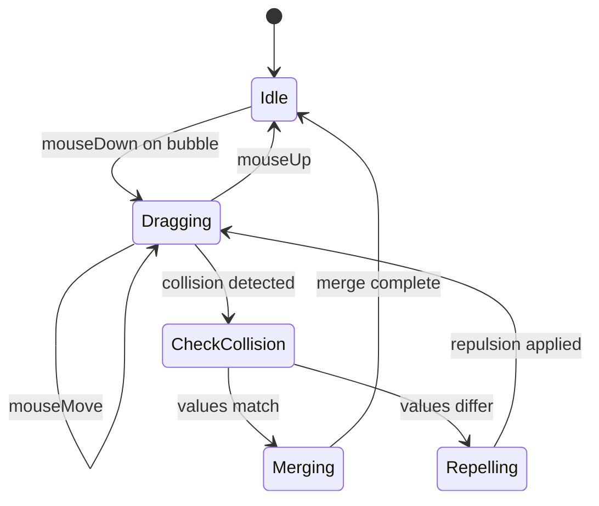

# Design Document: Bubble Drag-and-Merge

## Overview

This design implements interactive drag-and-merge functionality for the bubble game. The system extends the existing physics-based bubble simulation with user-controlled dragging, collision-based merging for matching values, and repulsion for non-matching values.

The implementation follows a state-machine approach where bubbles can be in either "physics-controlled" or "user-controlled" states. During dragging, the selected bubble transitions to user control while maintaining collision detection with other bubbles. The design preserves the existing physics engine for non-dragged bubbles while adding new interaction handlers.

## Architecture

### Component Structure

```
BubbleGame (Container)
├── State Management
│   ├── bubbles[] (position, velocity, value, radius, id)
│   ├── dragState (draggedBubbleId, isDragging, dragStartPos)
│   └── animationFrame (physics loop reference)
├── Event Handlers
│   ├── onMouseDown (drag initiation)
│   ├── onMouseMove (drag movement)
│   └── onMouseUp (drag release)
├── Physics Engine
│   ├── updatePositions()
│   ├── detectCollisions()
│   └── applyForces()
└── Bubble Components (presentational)
    └── Bubble (x, y, value, radius, isDragging, isHighlighted)
```

### State Flow



## Components and Interfaces

### Enhanced Bubble State

```typescript
interface Bubble {
  id: number;
  x: number;           // center x position
  y: number;           // center y position
  vx: number;          // x velocity
  vy: number;          // y velocity
  value: number;       // bubble value (1, 2, 3, ...)
  radius: number;      // bubble radius
  isDragging?: boolean; // visual state flag
  isHighlighted?: boolean; // collision preview flag
}
```

### Drag State

```typescript
interface DragState {
  isDragging: boolean;
  draggedBubbleId: number | null;
  lastMouseX: number;
  lastMouseY: number;
  dragStartTime: number;
}
```

### Collision Result

```typescript
interface CollisionResult {
  collided: boolean;
  targetBubble: Bubble | null;
  distance: number;
  canMerge: boolean;
}
```

## Data Models

### Bubble Position Calculation

Bubble positions are stored as center coordinates (x, y). For rendering, the CSS positioning uses top-left corner, requiring translation:
- CSS left = x - radius
- CSS top = y - radius

### Collision Detection

Two bubbles collide when:
```
distance = sqrt((x2 - x1)² + (y2 - y1)²)
collision = distance <= (radius1 + radius2)
```

### Merge Calculation

When two bubbles with value V merge:
- New value = V + V = 2V
- New position = ((x1 + x2) / 2, (y1 + y2) / 2)
- New radius = radius (unchanged for simplicity, or scale based on value)

### Repulsion Force

When bubbles with different values collide:
```
direction = normalize(targetPos - draggedPos)
repulsionForce = -direction * repulsionStrength
targetBubble.vx += repulsionForce.x
targetBubble.vy += repulsionForce.y
```

## Implementation Details

### Drag Initiation (Requirement 1)

**Event Handler:**
```javascript
const handleMouseDown = (event, bubbleId) => {
  const bubble = bubbles.find(b => b.id === bubbleId);
  if (!bubble) return;
  
  setDragState({
    isDragging: true,
    draggedBubbleId: bubbleId,
    lastMouseX: event.clientX,
    lastMouseY: event.clientY,
    dragStartTime: Date.now()
  });
  
  // Update bubble state
  bubble.isDragging = true;
  bubble.vx = 0;
  bubble.vy = 0;
};
```

**Key Decisions:**
- Attach mouseDown handler to individual Bubble components
- Store drag state at BubbleGame level for global access
- Zero out velocity immediately to prevent physics interference

### Drag Movement (Requirement 2)

**Event Handler:**
```javascript
const handleMouseMove = (event) => {
  if (!dragState.isDragging) return;
  
  const bubble = bubbles.find(b => b.id === dragState.draggedBubbleId);
  if (!bubble) return;
  
  // Update position to cursor, respecting boundaries
  const newX = Math.max(bubble.radius, 
                Math.min(event.clientX, width - bubble.radius));
  const newY = Math.max(80 + bubble.radius, 
                Math.min(event.clientY, height - bubble.radius));
  
  bubble.x = newX;
  bubble.y = newY;
  
  // Check for collisions
  const collision = detectDragCollision(bubble, bubbles);
  handleCollision(bubble, collision);
};
```

**Key Decisions:**
- Attach mouseMovehandler to document/container for smooth tracking
- Clamp position to boundaries during drag (not after)
- Collision detection runs every frame during drag

### Collision Detection (Requirement 3)

**Algorithm:**
```javascript
const detectDragCollision = (draggedBubble, allBubbles) => {
  let closestCollision = {
    collided: false,
    targetBubble: null,
    distance: Infinity,
    canMerge: false
  };
  
  for (const bubble of allBubbles) {
    if (bubble.id === draggedBubble.id) continue;
    
    const dx = bubble.x - draggedBubble.x;
    const dy = bubble.y - draggedBubble.y;
    const distance = Math.sqrt(dx * dx + dy * dy);
    const minDist = draggedBubble.radius + bubble.radius;
    
    if (distance <= minDist && distance < closestCollision.distance) {
      closestCollision = {
        collided: true,
        targetBubble: bubble,
        distance: distance,
        canMerge: bubble.value === draggedBubble.value
      };
    }
  }
  
  return closestCollision;
};
```

**Key Decisions:**
- Process only the closest collision (Requirement 8.2)
- Calculate collision once per frame to avoid redundant checks
- Return collision metadata for merge/repel decision

### Bubble Merging (Requirement 4)

**Merge Logic:**
```javascript
const mergeBubbles = (draggedBubble, targetBubble) => {
  const newBubble = {
    id: Date.now(),
    x: (draggedBubble.x + targetBubble.x) / 2,
    y: (draggedBubble.y + targetBubble.y) / 2,
    vx: 0,
    vy: 0,
    value: draggedBubble.value + targetBubble.value,
    radius: draggedBubble.radius, // or scale: radius * 1.1
    isDragging: false,
    isHighlighted: false
  };
  
  // Remove old bubbles and add new one
  setBubbles(prev => [
    ...prev.filter(b => b.id !== draggedBubble.id && b.id !== targetBubble.id),
    newBubble
  ]);
  
  // Exit drag mode
  setDragState({
    isDragging: false,
    draggedBubbleId: null,
    lastMouseX: 0,
    lastMouseY: 0,
    dragStartTime: 0
  });
};
```

**Key Decisions:**
- Create new bubble at midpoint (Requirement 4.3)
- Sum values for new bubble (Requirement 4.2)
- Exit drag mode immediately after merge (Requirement 4.5)
- Generate new ID to avoid conflicts

### Bubble Repulsion (Requirement 5)

**Repulsion Logic:**
```javascript
const applyRepulsion = (draggedBubble, targetBubble) => {
  const dx = targetBubble.x - draggedBubble.x;
  const dy = targetBubble.y - draggedBubble.y;
  const distance = Math.sqrt(dx * dx + dy * dy);
  
  if (distance === 0) return; // Avoid division by zero
  
  // Normalize direction and apply force
  const dirX = dx / distance;
  const dirY = dy / distance;
  const repulsionStrength = 5; // Tunable parameter
  
  targetBubble.vx += dirX * repulsionStrength;
  targetBubble.vy += dirY * repulsionStrength;
  
  // Separate bubbles to prevent overlap
  const overlap = (draggedBubble.radius + targetBubble.radius) - distance;
  if (overlap > 0) {
    targetBubble.x += dirX * overlap;
    targetBubble.y += dirY * overlap;
  }
};
```

**Key Decisions:**
- Apply force only to target bubble (Requirement 5.4)
- Immediate separation to prevent overlap (Requirement 5.5)
- Repulsion strength is tunable for game feel

### Drag Release (Requirement 6)

**Event Handler:**
```javascript
const handleMouseUp = () => {
  if (!dragState.isDragging) return;
  
  const bubble = bubbles.find(b => b.id === dragState.draggedBubbleId);
  if (bubble) {
    // Calculate release velocity based on drag motion
    const timeDelta = Date.now() - dragState.dragStartTime;
    const velocityScale = Math.min(timeDelta / 100, 1); // Clamp velocity
    
    bubble.vx = (event.clientX - dragState.lastMouseX) * velocityScale * 0.1;
    bubble.vy = (event.clientY - dragState.lastMouseY) * velocityScale * 0.1;
    bubble.isDragging = false;
  }
  
  setDragState({
    isDragging: false,
    draggedBubbleId: null,
    lastMouseX: 0,
    lastMouseY: 0,
    dragStartTime: 0
  });
};
```

**Key Decisions:**
- Calculate velocity from drag motion (Requirement 6.3)
- Re-enable physics by clearing isDragging flag (Requirement 6.2)
- Handle release anywhere (Requirement 6.5)

### Visual Feedback (Requirement 7)

**CSS Classes:**
```css
.bubble.dragging {
  cursor: grabbing;
  transform: scale(1.1);
  box-shadow: 0 4px 12px rgba(0, 0, 0, 0.3);
  z-index: 1000;
}

.bubble.can-merge {
  border: 3px solid #4CAF50;
  animation: pulse 0.5s infinite;
}

.bubble.cannot-merge {
  border: 3px solid #f44336;
}

@keyframes pulse {
  0%, 100% { transform: scale(1); }
  50% { transform: scale(1.05); }
}
```

**Key Decisions:**
- Scale up dragged bubble for visual prominence (Requirement 7.1)
- Green border for mergeable collisions (Requirement 7.2)
- Red border for non-mergeable collisions (Requirement 7.3)
- Pulse animation for merge preview

### Physics Integration

**Modified Animation Loop:**
```javascript
const animate = () => {
  const updatedBubbles = [...bubblesRef.current];
  
  updatedBubbles.forEach(bubble => {
    // Skip physics for dragged bubble
    if (bubble.id === dragState.draggedBubbleId) return;
    
    // Apply existing physics
    if (bubble.vx !== 0 || bubble.vy !== 0) {
      bubble.x += bubble.vx;
      bubble.y += bubble.vy;
      
      // Wall collisions, friction, etc.
      // ... existing physics code ...
    }
  });
  
  // Bubble-to-bubble collisions (skip dragged bubble)
  // ... existing collision code with isDragging check ...
  
  bubblesRef.current = updatedBubbles;
  setBubbles([...updatedBubbles]);
  animationRef.current = requestAnimationFrame(animate);
};
```

**Key Decisions:**
- Skip physics updates for dragged bubble
- Continue physics for all other bubbles
- Maintain existing collision detection for non-dragged bubbles


## Correctness Properties

*A property is a characteristic or behavior that should hold true across all valid executions of a system—essentially, a formal statement about what the system should do. Properties serve as the bridge between human-readable specifications and machine-verifiable correctness guarantees.*

### Property Reflection

After analyzing all acceptance criteria, I identified several areas where properties can be consolidated:

1. **Drag state properties (1.1, 1.3, 7.1)** - These all verify that entering drag mode sets appropriate flags. Can be combined into one property about drag state initialization.

2. **Boundary clamping (2.2, 2.3)** - Both test that bubbles stay within boundaries. The edge case (2.3) is covered by the general property (2.2).

3. **Collision detection (3.1, 3.3)** - Both verify collision detection works correctly. Can be combined into one property about collision accuracy.

4. **Merge properties (4.2, 4.3, 4.4)** - These all verify different aspects of the merge result. Can be combined into one comprehensive merge property.

5. **Repulsion properties (5.1, 5.3, 5.5)** - These verify different aspects of repulsion. Can be combined into one comprehensive repulsion property.

6. **Drag release properties (6.1, 6.2, 6.4)** - These all verify drag mode exit. Can be combined into one property about drag release.

7. **Visual feedback properties (7.2, 7.3)** - Both verify collision highlighting. Can be combined into one property about collision feedback.

8. **Multi-collision properties (8.1, 8.2)** - Both verify closest-first processing. Can be combined into one property.

### Properties

**Property 1: Drag initiation sets correct state**

*For any* bubble in the game, when a mouseDown event occurs on that bubble, the system should enter drag mode with isDragging=true, draggedBubbleId set to that bubble's ID, and the bubble's isDragging flag set to true.

**Validates: Requirements 1.1, 1.3, 7.1**

---

**Property 2: Empty space clicks don't trigger drag**

*For any* mouseDown event at a position not occupied by any bubble, the system should remain in idle state with isDragging=false and draggedBubbleId=null.

**Validates: Requirements 1.4**

---

**Property 3: Physics disabled during drag**

*For any* bubble being dragged, physics updates (velocity-based position changes, friction, wall bounces) should not be applied to that bubble while isDragging is true.

**Validates: Requirements 1.2**

---

**Property 4: Dragged bubble follows cursor**

*For any* bubble being dragged and any mouseMove event, the bubble's position should match the cursor position (clamped to boundaries).

**Validates: Requirements 2.1, 2.2**

---

**Property 5: Drag preserves bubble properties**

*For any* bubble being dragged, the bubble's radius and value should remain unchanged throughout the entire drag operation.

**Validates: Requirements 2.4**

---

**Property 6: Collision detection accuracy**

*For any* dragged bubble and any other bubble, a collision should be detected if and only if the distance between their centers is less than or equal to the sum of their radii.

**Validates: Requirements 3.1, 3.3**

---

**Property 7: Value matching detection**

*For any* collision between a dragged bubble and a target bubble, the system should correctly identify whether their values match (equal) or differ (not equal).

**Validates: Requirements 3.4**

---

**Property 8: Merge creates correct result**

*For any* two bubbles with matching values that collide during drag, the merge should produce a new bubble with: (1) value equal to the sum of the two original values, (2) position at the midpoint of the two original positions, (3) both original bubbles removed from the game, and (4) drag mode exited.

**Validates: Requirements 4.1, 4.2, 4.3, 4.4, 4.5**

---

**Property 9: Repulsion pushes target away**

*For any* collision between a dragged bubble and a target bubble with different values, the target bubble should receive velocity in a direction away from the dragged bubble, and the distance between bubbles should be at least the sum of their radii after repulsion.

**Validates: Requirements 5.1, 5.3, 5.5**

---

**Property 10: Dragged bubble unaffected by repulsion**

*For any* repulsion event, the dragged bubble's position should continue to match the cursor position and should not be affected by the repulsion force applied to the target bubble.

**Validates: Requirements 5.4**

---

**Property 11: Drag release exits drag mode**

*For any* bubble being dragged, when a mouseUp event occurs, the system should exit drag mode with isDragging=false, draggedBubbleId=null, and the bubble's isDragging flag set to false.

**Validates: Requirements 6.1, 6.2, 6.4**

---

**Property 12: Release velocity calculation**

*For any* drag release, the released bubble should have velocity proportional to the drag motion (difference between current and previous cursor positions).

**Validates: Requirements 6.3**

---

**Property 13: Collision highlighting**

*For any* collision during drag, if the values match, both bubbles should have isHighlighted=true; if values differ, appropriate incompatibility flags should be set.

**Validates: Requirements 7.2, 7.3**

---

**Property 14: Closest collision processed first**

*For any* dragged bubble colliding with multiple bubbles simultaneously, the collision with the smallest distance should be processed first, and if it's a matching-value collision, merge should occur with that closest bubble.

**Validates: Requirements 8.1, 8.2**

---

**Property 15: Merge exits drag immediately**

*For any* merge that occurs while multiple collisions are present, drag mode should exit immediately without processing additional collisions.

**Validates: Requirements 8.3**

---

**Property 16: Multiple repulsions applied**

*For any* dragged bubble colliding with multiple non-matching bubbles simultaneously, repulsion forces should be applied to all colliding bubbles.

**Validates: Requirements 8.4**

## Error Handling

### Invalid State Transitions

**Scenario:** Drag state becomes inconsistent (e.g., isDragging=true but draggedBubbleId=null)

**Handling:**
- Validate drag state on every update
- Reset to idle state if inconsistency detected
- Log warning for debugging

### Bubble Not Found

**Scenario:** draggedBubbleId references a bubble that no longer exists (e.g., merged during drag)

**Handling:**
- Check bubble existence before operations
- Exit drag mode if bubble not found
- Prevent null reference errors

### Boundary Violations

**Scenario:** Bubble position calculated outside valid boundaries

**Handling:**
- Clamp all positions to valid range before applying
- Ensure radius is considered in boundary calculations
- Prevent bubbles from getting stuck in walls

### Division by Zero

**Scenario:** Distance calculation results in zero when normalizing direction vectors

**Handling:**
- Check for zero distance before normalization
- Skip repulsion if bubbles are exactly overlapping
- Use small epsilon value for comparison

### Rapid State Changes

**Scenario:** Multiple mouseDown/mouseUp events in quick succession

**Handling:**
- Debounce or ignore events while in transition
- Complete current operation before accepting new input
- Prevent race conditions in state updates

## Testing Strategy

### Dual Testing Approach

This feature will be tested using both unit tests and property-based tests:

- **Unit tests**: Verify specific examples, edge cases, and error conditions
- **Property tests**: Verify universal properties across all inputs
- Both are complementary and necessary for comprehensive coverage

### Property-Based Testing

We will use **fast-check** (JavaScript property-based testing library) to implement the correctness properties defined above.

**Configuration:**
- Minimum 100 iterations per property test
- Each test tagged with: **Feature: bubble-drag-merge, Property N: [property text]**

**Test Structure:**
```javascript
import fc from 'fast-check';

describe('Bubble Drag-Merge Properties', () => {
  it('Property 1: Drag initiation sets correct state', () => {
    // Feature: bubble-drag-merge, Property 1: Drag initiation sets correct state
    fc.assert(
      fc.property(
        bubbleArbitrary(),
        (bubble) => {
          // Test implementation
        }
      ),
      { numRuns: 100 }
    );
  });
});
```

**Generators Needed:**
- `bubbleArbitrary()`: Generate random bubbles with valid positions, values, radii
- `positionArbitrary()`: Generate random x,y coordinates within boundaries
- `mouseEventArbitrary()`: Generate random mouse events with positions
- `bubbleArrayArbitrary()`: Generate arrays of non-overlapping bubbles

### Unit Testing

Unit tests will focus on:

1. **Specific Examples:**
   - Drag a bubble with value 2 into another with value 2, verify merge creates value 4
   - Drag a bubble with value 1 into another with value 3, verify repulsion occurs
   - Release drag with specific motion, verify velocity calculation

2. **Edge Cases:**
   - Drag to exact boundary position
   - Release mouse outside game area
   - Merge when multiple matching bubbles present
   - Collision with zero distance (exact overlap)

3. **Error Conditions:**
   - Attempt to drag non-existent bubble
   - Mouse events with invalid coordinates
   - State inconsistencies (isDragging without draggedBubbleId)

4. **Integration:**
   - Complete drag-merge-release cycle
   - Multiple sequential drags
   - Drag during active physics simulation
   - Interaction with existing collision system

### Test Coverage Goals

- All 16 correctness properties implemented as property tests
- All error handling paths covered by unit tests
- All edge cases identified in prework covered
- Integration tests for complete user workflows
